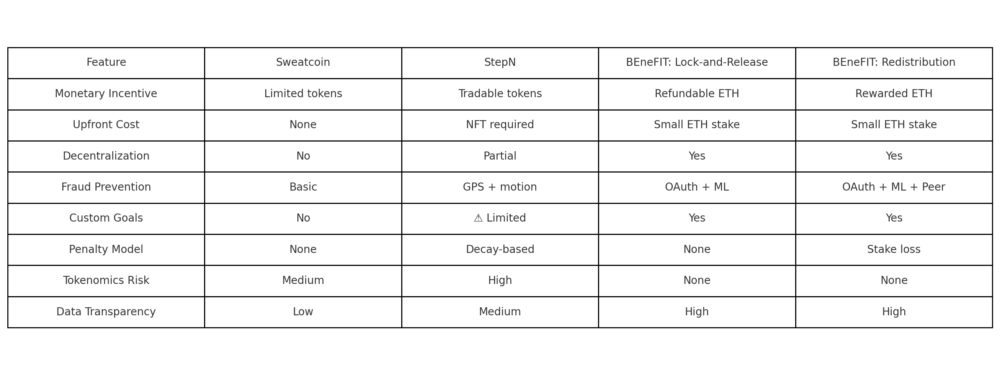

# BEneFIT: A Decentralized Fitness Accountability Framework
<div align="justify">
BEneFIT is a research-backed framework that leverages decentralized technologies and behavioral psychology to encourage users to stick to their fitness goals. It introduces ETH-backed staking, fraud-resistant validation, and smart contract enforcement — all while offering flexible incentive models designed to match different user preferences.

---

## 📄 Table of Contents

- [Overview](#-overview)
- [Project Goals](#-project-goals)
- [Key Features](#-key-features)
- [Improvements Introduced](#-improvements-introduced)
- [Research Folder](#-research-folder-structure)
- [Prototype Folder](#-prototype-folder-structure)
- [Evaluation Summary](#-evaluation-summary)
- [References](#-references)
- [Demo Video](#-demo-video)
- [Authors](#-authors)

---

## 🧠 Overview

This project critically analyzes existing fitness incentive apps like **StepN** and **Sweatcoin**, identifies their weaknesses (fraud, centralization, rigid models), and proposes two ETH-staking models:

- **Lock-and-Release**: Solo-based. ETH is returned if the goal is achieved.
- **Redistribution**: Group-based. ETH from failed users is redistributed to successful ones.

Each model supports API-based data validation, optional ML-based fraud detection, and complete smart contract automation.

---

## 🎯 Project Goals

- Review and critique current M2E systems and literature  
- Design a decentralized, privacy-preserving, fraud-resistant framework  
- Support both competitive and non-competitive fitness users  
- (Optional) Build a working prototype with smart contracts + basic UI  

---

## ⚙️ Key Features

- ✅ Anonymous goal setting  
- ✅ ETH staking for accountability  
- ✅ Verifiable health data (Google Fit / Apple Health)  
- ✅ Peer-based validation (Redistribution model)  
- ✅ Optional ML-based fraud detection  
- ✅ Smart contract-based fund release or redistribution  

---

## 💡 Improvements Introduced

- **True Decentralization**: No central authority managing goals or funds  
- **Custom Goal Support**: Users define their own fitness commitments  
- **Fairness-First**: Validators are rewarded; cheaters are penalized via logic, not opinion  
- **Fraud Prevention**: Includes ML-based detection or oracle integration  

---

## 📁 Research Folder Structure

<details>
<summary><strong>Click to expand</strong></summary>

```text
research/
├── 01_Introduction.md
├── 02_objective.md
├── 03_related_work.md
├── 04_Methodology_LockAndRelease.md
├── 05_Methodology_Redistribution.md
├── 06_Evaluation_Comparison.md
├── 07_Conclusion.md
├── 08_References.md
└── Images/
    ├── comparision.png
    ├── Architecture.png
    ├── Architecture_LockAndRelease.png
    ├── workflow.png
    ├── workflow_LockAndRelease.png
    ├── smart_contract.png
    └── smart_contract_LockAndRelease.png
```

</details>

Each file covers a distinct research section — from literature to methodology to evaluation and future scope.

---

## 🧪 Prototype Folder Structure

<details>
<summary><strong>Click to expand</strong></summary>

```text
Prototype/
├── client/              # Frontend (optional)
├── server/              # Backend API (optional)
├── contract_code/       # Smart contract code (Solidity)
├── package.json         # Dependencies (for Node or testing)
```

</details>

Note: This prototype is optional and may contain simplified implementations for ETH staking and goal verification logic.

---

## 📊 Evaluation Summary

Comparison of BEneFIT with existing M2E apps:



BEneFIT outperforms both Sweatcoin and StepN in transparency, flexibility, decentralization, and fairness — without relying on speculative token economies.

---

## 📚 References

Detailed academic and app references are listed in  
➡ [09_References.md](./research/09_References.md)

---

## 🎥 Demo Video

A demonstration video showcasing the BEneFIT framework, its prototype, and the ETH-staking models is available here:  
➡ [Watch the Video](https://drive.google.com/file/d/1Q9owTK-uGbansKn5WoXiDxKAsk3fv_6N/view?usp=sharing)

---

## 👥 Authors

- **Kushi Reddy Kankar(kushi.reddy.kankar-1@ou.edu)**
- **Rohan Mukka(rohan.mukka-1@ou.edu)**  

---