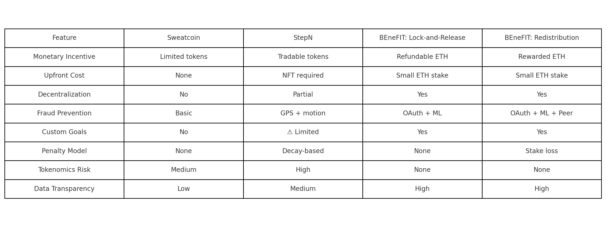

# Evaluation & Comparison

This section evaluates the two incentive models implemented in BEneFIT — **Lock-and-Release** and **Redistribution** — and compares them with leading Move-to-Earn (M2E) applications such as **StepN** and **Sweatcoin**.

---

## 1. Internal Model Comparison (BEneFIT)

| Aspect                       | Lock-and-Release                            | Redistribution Model                             |
|-----------------------------|---------------------------------------------|--------------------------------------------------|
| **Competition Style**       | Solo-based                                  | Group-based                                      |
| **Stake Outcome**           | Returned on goal success                    | Lost if goal fails, redistributed to others      |
| **Validation Type**         | API + optional ML                           | API + Peer Voting + optional ML                  |
| **Privacy Level**           | High (wallet-only)                          | Medium (goal/data visible to peers)              |
| **Trust Mechanism**         | Fully automated smart contract logic        | Trustless + social validation                    |
| **Fraud Resistance**        | OAuth + backend ML                          | OAuth + ML + peer validation                     |
| **Gas Cost**                | Low                                         | Medium to High                                   |
| **Scalability**             | High (no validators needed)                 | Medium (depends on active validator pool)        |
| **Ideal User Type**         | Individuals seeking private accountability  | Competitive users motivated by group validation  |

---

## 2. BEneFIT vs Existing M2E Apps

| Feature / App                | Sweatcoin                | StepN                        | BEneFIT: Lock-and-Release     | BEneFIT: Redistribution         |
|-----------------------------|--------------------------|------------------------------|-------------------------------|----------------------------------|
| **Monetary Incentive**      | Limited tokens           | Tradable crypto tokens       | Refundable ETH                | Rewarded ETH                     |
| **Upfront Cost**            | None                     | NFT required                 | Small ETH stake               | Small ETH stake                  |
| **Decentralization**        | No                       | Partial                      | Yes                           | Yes                              |
| **Fraud Prevention**        | Basic GPS + steps        | GPS + motion                 | OAuth + ML                    | OAuth + ML + Peer Voting         |
| **Custom Goals**            | No                       | Partial                      | Yes                           | Yes                              |
| **Penalty Model**           | None                     | Time-based reward decay      | None                          | Stake loss if goal fails         |
| **Tokenomics Risk**         | Medium                   | High                         | None                          | None                             |
| **Data Transparency**       | Low                      | Medium                       | High (on-chain)               | High (on-chain)                  |

---

## 3. Security & Fairness Summary

| Criteria                  | Sweatcoin   | StepN     | Lock-and-Release   | Redistribution Model |
|--------------------------|-------------|-----------|--------------------|----------------------|
| **Spoof Resistance**     | Low         | Medium    | High               | Very High            |
| **Transparency**         | Low         | Medium    | High               | High                 |
| **Fairness to Honest Users** | Medium  | Low       | High               | Medium-High          |
| **User Ownership**       | No          | Partial   | Yes                | Yes                  |

---

## 4. Observations

- **Sweatcoin** lacks tradeable rewards and operates entirely within a centralized ecosystem.
- **StepN** introduces crypto tokens and NFTs but has significant onboarding friction and token inflation issues.
- **BEneFIT** bridges the gap by offering:
  - Real monetary value (ETH),
  - Full decentralization with transparent smart contracts,
  - Customizable goals,
  - Robust fraud protection.

---

## 5. Visual Summary

The figure below provides a side-by-side comparison of all platforms across core features:

  

---

## 6. Conclusion

BEneFIT’s two incentive models provide flexible pathways to support both competitive and non-competitive users. Compared to existing M2E applications, it achieves greater decentralization, user privacy, and fairness — making it a promising framework for the future of trustless health motivation.

