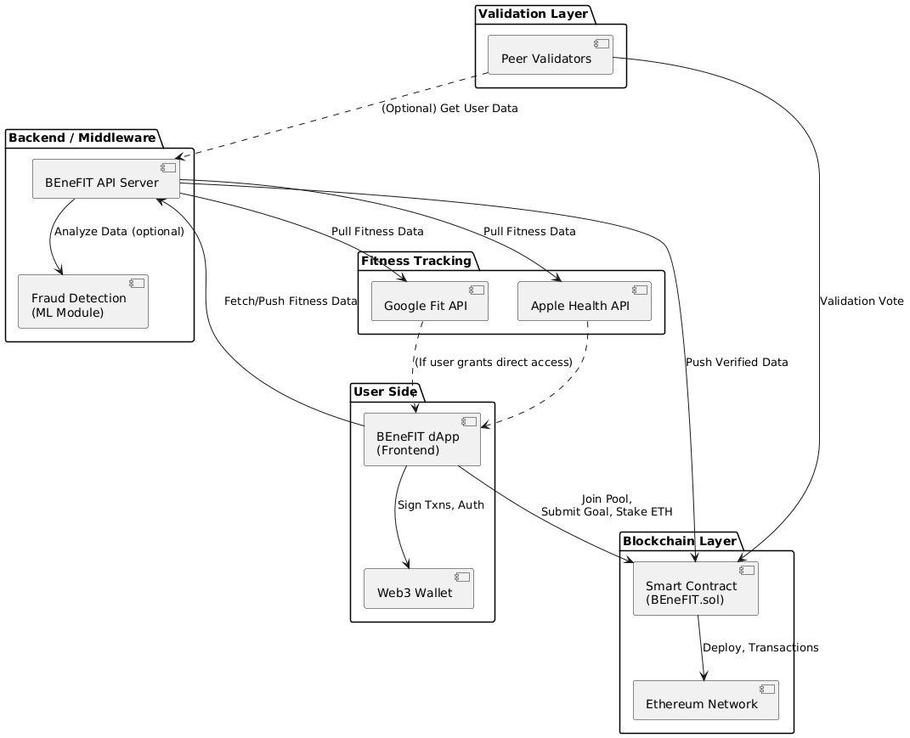
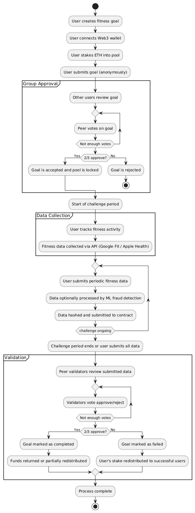
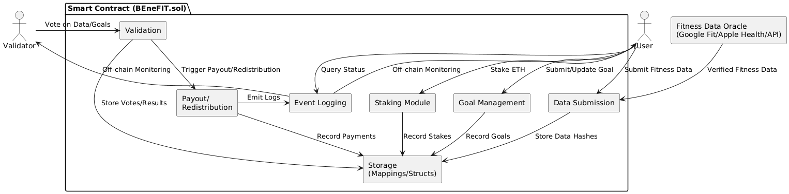

# Methodology

The BEneFIT project leverages a modular, decentralized architecture and a robust, privacy-preserving workflow to deliver trustless, community-driven fitness accountability. This methodology details the architecture, workflow, and smart contract design powering the platform.

---

## 1. System Architecture

The system is divided into clearly defined layers: **User Side**, **Fitness Tracking**, **Backend/Middleware**, **Blockchain Layer**, and **Validation Layer**. Each layer interacts through secure interfaces, minimizing trust assumptions and maximizing transparency.

**Figure 1: System Architecture**

- **User Side:**  
  - The **BEneFIT dApp (Frontend)** enables users to set goals, track progress, and interact with smart contracts, signing transactions via their Web3 wallet.
- **Fitness Tracking:**  
  - Integrates **Google Fit API** and **Apple Health API** for verified, tamper-resistant fitness data collection.
- **Backend/Middleware:**  
  - The **API Server** manages fitness data fetch/normalization and can optionally run fraud detection (ML module).
- **Blockchain Layer:**  
  - The **BEneFIT smart contract** on Ethereum manages staking, validation, and rewards distribution.
- **Validation Layer:**  
  - **Peer Validators** approve goals and verify data, ensuring fairness through community consensus.

---

## 2. User Workflow

The BEneFIT process is broken down into intuitive phases, each supported by protocol logic and community validation. The workflow ensures that every goal, data point, and payout is fair, auditable, and decentralized.

**Figure 2: User Workflow**

### 2.1 Group Approval

- User sets a personal fitness goal and stakes ETH using their Web3 wallet.
- Goal is submitted anonymously for peer review.
- Other users in the pool review and vote on the goal.
- If two-thirds approve, the goal is accepted and the pool is locked; if not, the user is refunded.

### 2.2 Data Collection

- User completes fitness challenges during the agreed period.
- Fitness data is collected automatically via API or manually, with the option for ML-based fraud detection.
- Each submission is hashed for privacy and sent to the smart contract.

### 2.3 Validation

- At the end of the period, peer validators review the submitted data and vote.
- If two-thirds approve, the user is rewarded (either refunded or through redistribution); if not, their stake is redistributed.

---

## 3. Smart Contract Architecture

The BEneFIT smart contract (`BEneFIT.sol`) is built with a modular approach, encapsulating all core functionalities needed for trustless fitness accountability.

**Figure 3: Smart Contract Architecture**

### Main Modules

- **Staking Module:** Handles user deposits, pool formation, and enforces participation rules.
- **Goal Management:** Allows submission, storage, and approval tracking for fitness goals.
- **Data Submission:** Handles storage of (hashed/API-verified) fitness data submissions.
- **Validation:** Collects and tallies validator votes for both goals and data submissions.
- **Payout/Redistribution:** Automates fund distribution based on challenge outcomes and consensus.
- **Storage (Mappings/Structs):** On-chain records for stakes, goals, data, votes, and results.
- **Event Logging:** Emits all major events for off-chain monitoring and transparency.

### Actors

- **User:** Stakes ETH, submits goals and data, queries contract state.
- **Validator:** Reviews goals and data, casts votes, earns rewards.
- **Fitness Data Oracle:** (Optional) Verifies off-chain fitness data and feeds it into the contract.

---

## 4. Data Verification & Fraud Prevention

- Integrates APIs (Google Fit, Apple Health) to minimize manual entry and fraud.
- Optional machine learning module flags suspicious data before submission.
- Peer validators review and approve both goals and fitness data.

---

## 5. Privacy & Security

- Users remain pseudonymous—only wallet addresses are used.
- Fitness data is hashed/encrypted before being written on-chain.
- All validator votes and payouts are transparent, but no sensitive personal data is exposed.

---

## 6. Summary

This methodology underpins BEneFIT's vision of decentralized, transparent, and fair fitness accountability. By combining peer review, cryptographic automation, and privacy-centric data collection, BEneFIT sets a new standard for move-to-earn and fitness incentive platforms.

---