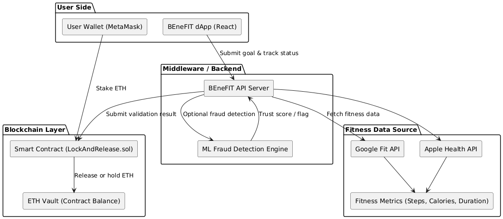
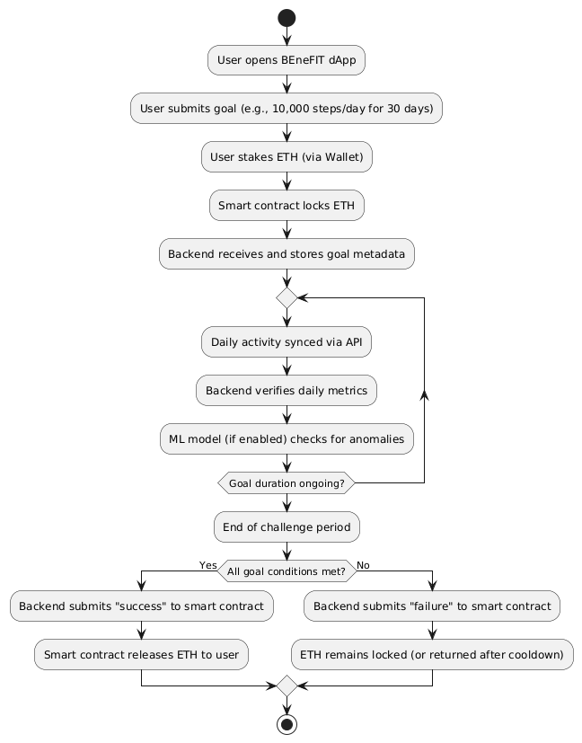
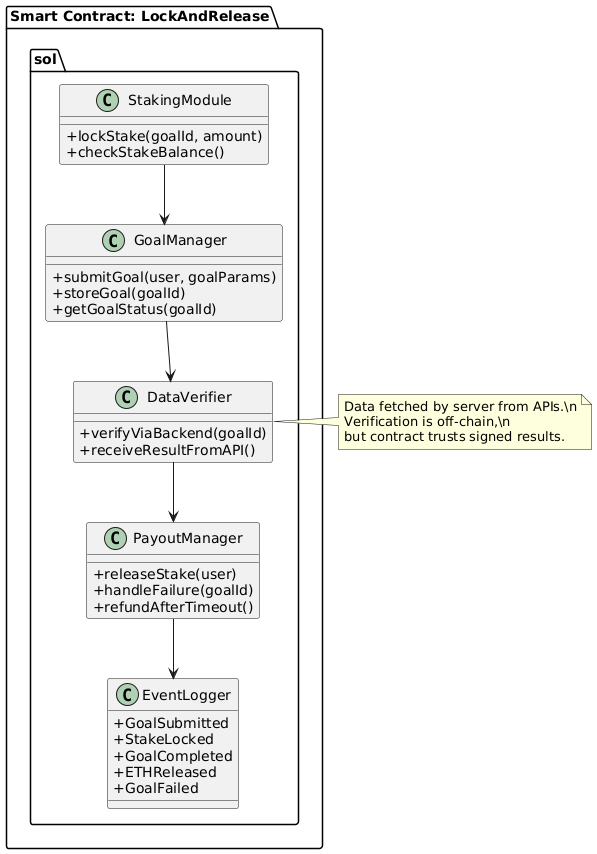

# Methodology – Lock-and-Release Model

The BEneFIT project leverages a modular, decentralized architecture and a privacy-focused ETH lockup system to encourage fitness goal adherence without peer competition. This methodology details the architecture, workflow, and smart contract design powering the **Lock-and-Release** variant of the platform.

---

## 1. System Architecture

The system is divided into functional layers: **User Layer**, **Fitness Tracking**, **Backend/Middleware**, **Blockchain Layer**, and **Validation Layer**. These interact securely to enable ETH-based commitment toward fitness goals.

**Figure 1: System Architecture**

- **User Layer:**  
  - The BEneFIT dApp allows users to set personal goals, lock ETH via wallet, and monitor progress.
  
- **Fitness Tracking:**  
  - Fitness data is collected via **Google Fit** or **Apple Health** APIs, optionally supported by manual upload.

- **Backend/Middleware:**  
  - Normalizes data, optionally runs fraud detection (ML), and interfaces with the smart contract.

- **Blockchain Layer:**  
  - A smart contract holds user ETH in a vault and automates validation and fund release logic.

- **Validation Layer:**  
  - A set of peer validators anonymously review submitted fitness data and vote on legitimacy.

---

## 2. User Workflow

BEneFIT’s Lock-and-Release model follows an intuitive, trustless fitness journey broken into phases.

**Figure 2: User Workflow**

### 2.1 Goal Locking

- User submits a personal fitness goal through the dApp and stakes ETH into a smart contract.
- The goal is anonymously reviewed and approved by at least 2/3 of peer validators.
- If approved, the ETH is locked and the challenge begins.

### 2.2 Fitness Tracking

- User performs the goal over the agreed period (e.g., 4 weeks).
- Data is collected automatically or manually, hashed for privacy, and uploaded to the dApp.
- Optionally, ML-based fraud detection flags anomalies before submission.

### 2.3 Result Validation

- At the end of the challenge, validators review submitted evidence and vote.
- If 2/3 approve, the user is refunded their ETH stake.
- If not, ETH remains locked or is returned after a cooldown (no redistribution).

---

## 3. Smart Contract Architecture

The BEneFIT Lock-and-Release contract handles all aspects of user staking, data handling, and vote-based fund release.

**Figure 3: Smart Contract Architecture**

### Main Modules

- **Staking Module:** Accepts ETH and ties it to user-specific goal IDs.
- **Goal Management:** Tracks goal submissions and approval voting.
- **Data Submission:** Accepts data hashes or proof tokens for completed challenges.
- **Validation Logic:** Tally votes and determine fund release outcome.
- **Payout Module:** Refunds staked ETH if goals are validated; holds it otherwise.
- **Event Logging:** Emits all major events for auditability.

### Actors

- **User:** Stakes ETH and completes personal goals.
- **Validator:** Reviews goals and data, casts votes, and builds trust.
- **Fitness Oracle (optional):** Certifies fitness data integrity from APIs or wearables.

---

## 4. Data Verification & Fraud Prevention

- Integrates Google Fit / Apple HealthKit for API-verified data.
- Optionally runs a CNN-based model to detect fake activity patterns (e.g., auto-walking).
- Flags outliers before validator review.

---

## 5. Privacy & Security

- Users are pseudonymous (identified only by wallet addresses).
- Fitness data is hashed before submission to preserve confidentiality.
- Votes and payouts are public, but private fitness details remain hidden.

---

## 6. Summary

The Lock-and-Release model promotes personal fitness accountability without the pressure of losing funds to others. ETH is staked as motivation and only returned upon success. Validators ensure fairness, and ML-based fraud detection boosts integrity. This model is ideal for users seeking **non-competitive, self-driven fitness incentives** in a decentralized environment.

---

