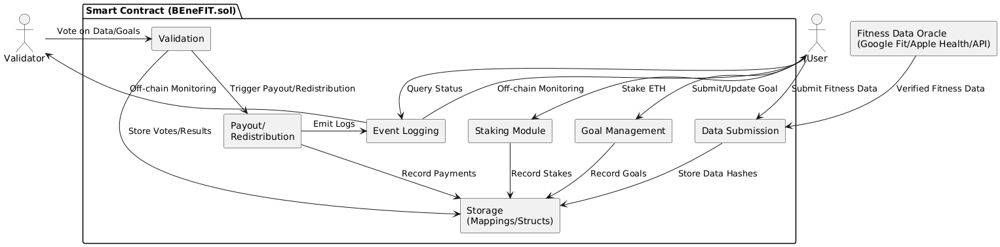

# BEneFIT – Redistribution Model Methodology

BEneFIT introduces a **trustless, decentralized fitness accountability platform** combining behavioral psychology and decentralized finance (DeFi). This model uses ETH staking and peer validation to promote commitment to personal fitness goals while deterring freeloading or cheating. It offers a privacy-respecting, transparent alternative to centralized apps like Stepn or Sweatcoin.

---
## 📚 Table of Contents

1. [🚀 Introduction](#-introduction)
2. [📌 What This Model Does (In Detail)](#-what-this-model-does-in-detail)
3. [🏗️ System Architecture](#️-system-architecture)
4. [🔁 User Workflow](#-user-workflow)
5. [🔐 Smart Contract Architecture](#-smart-contract-architecture)
6. [🧠 Data Verification & Fraud Prevention](#-data-verification--fraud-prevention)
7. [🔒 Privacy & Security](#-privacy--security)
8. [🔄 Trust Assumptions](#-trust-assumptions)
9. [📚 Lessons from Real-World dApps](#-lessons-from-real-world-dapps)
10. [🧾 Example Walkthrough](#-example-walkthrough)
11. [🔮 Future Work](#-future-work)
12. [✅ Summary](#-summary)

---

## 🚀 Introduction

Incentivizing fitness with monetary rewards is not new—apps like **Stepn**, **Sweatcoin**, and **GymPact** have attempted this. However, they often rely on **centralized control**, **inflationary tokens**, or **non-transparent data verification**.

**BEneFIT adds value through decentralization by:**
- Using **real ETH staking** rather than speculative tokens.
- Relying on **peer validation** and **smart contract-enforced rules**.
- Providing **open, transparent audits** of every vote and payout.
- Ensuring **pseudonymity and data privacy**.

---

## 📌 2. What This Model Does (In Detail)

The **BEneFIT Redistribution Model** creates a self-governing ecosystem where users **stake ETH**, submit **fitness goals**, and get **rewards or penalties** based on whether they complete their goals—and whether the community believes their data is legitimate.

### 🧍 For Users:
1. **Stake ETH** as a financial commitment toward completing a personal fitness goal (e.g., walking 10,000 steps for 7 days).
2. **Submit the goal anonymously** through the BEneFIT dApp.
3. Wait for **peer approval** — at least 2/3 of randomly selected validators must approve the goal.
4. If approved:
   - The goal is **locked**, and the stake is stored in the smart contract.
   - The user proceeds to perform the goal over the required time.
5. **Automatically (or manually)** sync their fitness data (via Google Fit / Apple Health).
6. Submit data (in hashed form) before the deadline.
7. Wait for **data validation** by peer validators.
8. If the data is approved by 2/3 validators:
   - The user is **refunded the ETH stake**, or rewarded extra ETH (if others failed).
   - Their completion is **logged permanently** on-chain.
9. If rejected:
   - The stake is **redistributed** to a pool of successful users.
   - The failed attempt is also logged (without exposing personal data).

### 👥 For Validators:
1. **Randomly assigned** to review goals and fitness data submissions.
2. Must review the goal and vote “Approve” or “Reject” within a time window.
3. Later, vote on whether the submitted data is **genuine and consistent**.
4. Honest validators are **rewarded with a share of redistributed ETH** or validator bonuses.
5. Dishonest or inactive validators may lose reputation or future selection chances (future feature).

### 🧠 Smart Contract Logic:
- Written in Solidity, the contract:
  - Collects **user stakes**.
  - Waits for **2/3 peer approvals** for both goal and data.
  - Automatically **releases or redistributes** funds based on validator votes.
  - Emits **event logs** for frontend status updates and off-chain analytics.
  - Ensures **no human admin** can change votes or override logic.
  - Stores minimal user information: only **hashed data and wallet address**.

### 💡 What Makes This Model Unique
- Unlike “lock-and-release” models where you only get your stake back, this model uses **peer-reviewed redistribution** — failing users fund successful users.
- It combines **social accountability** (validators) with **cryptographic trust** (hashing, smart contracts).
- Fitness data is never stored on-chain — only its **hashed proof** is — ensuring privacy.
- The model does **not require a centralized company, server, or token** to function.

---

## 🏗️ 3. System Architecture

BEneFIT is structured into five functional layers to ensure modularity, scalability, and minimal trust assumptions:

- **User Interface Layer**: dApp for users to set goals, stake ETH, and view progress.
- **Fitness Tracking Layer**: Integrates with **Google Fit** and **Apple Health** for automatic data sync.
- **Middleware Layer**: Fetches and standardizes fitness data; runs optional ML-based fraud detection.
- **Blockchain Layer**: Hosts the smart contract managing staking, voting, and redistribution.
- **Validation Layer**: Peer users vote anonymously to validate goals and data.

---

## 🔁 4. User Workflow

BEneFIT’s process ensures accountability through community governance and cryptographic verification.

### 🟢 4.1 Group Approval
- A user submits a fitness goal and stakes ETH.
- The goal is anonymized and sent to a random validator pool.
- If **2/3** approve, the goal is accepted and the pool is locked.

### 📊 4.2 Data Collection
- Fitness activity is completed and synced via API or manually entered.
- Data is hashed and submitted to the contract.
- Optional ML detects tampering or spoofing patterns.

### ✅ 4.3 Validation & Payout
- Validators review the submitted data.
- If approved (≥2/3), ETH is returned (or extra rewarded).
- If rejected, the ETH is **redistributed** to compliant users.

---

## 🔐 5. Smart Contract Architecture

### Key Modules

| Module                  | Purpose                                             |
|--------------------------|-----------------------------------------------------|
| **Staking**             | Manages deposits and participant grouping            |
| **Goal Management**     | Stores goals and tracks approval voting              |
| **Data Submission**     | Accepts hashed fitness data with timestamps          |
| **Validation**          | Tallies validator votes for both goals and data      |
| **Payout/Redistribution** | Redistributes ETH based on consensus result       |
| **Storage/Events**      | Tracks mappings and emits events for transparency    |

---

## 🧠 6. Data Verification & Fraud Prevention

- **APIs Used**: Google Fit, Apple Health with OAuth2 tokens.
- **Hashing**: Raw fitness data never stored—only cryptographic hashes.
- **ML Model** (optional): Detects unrealistic behaviors or tampering.
- **Peer Voting**: Adds human review to reduce false positives/negatives.

---

## 🔒 7. Privacy & Security

- Users remain **anonymous**—wallet address only.
- Submissions are **hashed** for confidentiality.
- Validator decisions and payouts are **auditable and immutable**.

---

## 🔄 8. Trust Assumptions

- Google Fit/Apple Health data is reasonably secure.
- Validators are staked and randomized to avoid collusion.
- Malicious users face stake loss and rejection.
- All logic is enforceable **on-chain**—no centralized moderation.

---

## 📚 9. Lessons from Real-World dApps

| App       | Problem                        | BEneFIT's Solution                         |
|-----------|--------------------------------|--------------------------------------------|
| **Stepn** | Token inflation and poor retention | Uses ETH (non-inflationary), real staking  |
| **Sweatcoin** | Centralized data & rewards | Peer-reviewed, on-chain logic with API data |
| Both      | No fraud resistance            | ML + peer validation + hash-based audit    |

---

## 🧾 10. Example Walkthrough

> **Alice stakes 0.1 ETH** to walk 10,000 steps daily for 7 days.  
> Her goal is approved (4 of 5 votes).  
> She submits hashed step data.  
> Validators approve again.  
> **She gets back 0.1 ETH + 0.02 ETH from a failed user.**

---

## 🔮 11. Future Work

- 🛡️ Zero-Knowledge Proofs for data submission
- 🔗 Chainlink Functions for secure oracle data feeds
- ⭐ Validator Reputation Scores for better voting reliability
- 📱 Cross-platform mobile dApp with push alerts and gamified UI
- 🧩 Integrating collaborative/group goals and community challenges

---

## ✅ Summary

BEneFIT offers a transparent, decentralized alternative to gamified fitness platforms by **rewarding real commitment** and **penalizing dishonesty**, all while preserving privacy and trust via cryptography and smart contracts.

